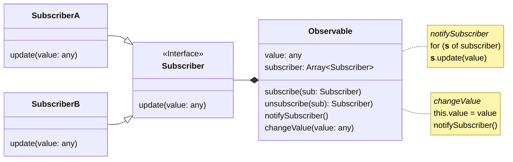

# Under the Hood 👀

<v-click><p>Observer Pattern</p></v-click>

---
title: UML
---

# Zur Erinnerung



---
title: Code Example
---

# Code Beispiel

<!-- TODO: was genau will ich hier zeigen/sagen? -->

```js {*}{ maxHeight:'90%' }
function observable(value) {
    let _value = value

    const subscribers = new Set()
    function notifySubscriber() {
        subscribers.forEach((fn) => fn(_value))
    }

    return {
        subscribe(fn) {
            subscribers.add(fn)
            return () => subscribers.delete(fn) // unsubscribe
        },
        get value() {
            return _value
        },
        set value(v) {
            _value = v
            notifySubscriber()
        },
    }
}
```

---
title: Probleme
---

# Was fehlt?

<v-clicks>

> "Automatic state binding and dependency tracking" - Preact

```js
const count = observable(1)
let double = count.value * 2
const unsubscribe = count.subscribe((value) => (double = value * 2))

console.log(double)
count.value = 2
console.log(double)
```

</v-clicks>
<v-clicks>

1. Manuelles State Binding
    - Was ist bei mehreren Abhängigkeiten?
2. Dependencies sind lose gekoppelt
    - Wer kümmert sich um das unsubscribe?

</v-clicks>

<!--
Hier können wir die Definition vom Anfang ranziehen
"Automatic state binding and dependency tracking"

# Probleme
1. Automatic state binding
    - Manuelles State Binding
    - Multiple State Binding
2. Dependency tracking
    - Wer handelt Unsuscribe?
    - Subscribers sind im Scope vom Observable
-->
