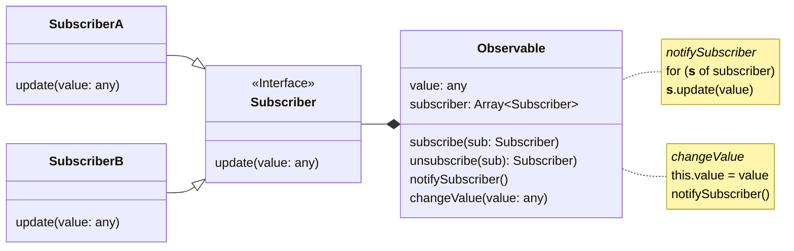

# Under the Hood 👀

<v-click><p>Observer Pattern</p></v-click>

---
title: UML
---

# Zur Erinnerung



---
title: Code Example
---

# Code Beispiel

<!-- TODO: was genau will ich hier zeigen/sagen? -->

```js {*}{ maxHeight:'80%' }
function observable(value) {
    let _value = value
    const subscribers = new Set()

    return {
        subscribe(fn) {
            subscribers.add(fn)
            return () => subscribers.delete(fn) // unsubscribe
        },
        notifySubscriber(value) {
            subscribers.forEach((fn) => fn(value))
        },
        changeValue(v) {
            _value = v
            this.notifySubscriber(value)
        },
    }
}
```

---
title: Probleme
---

# Probleme / Schwierigkeiten

> TODO: alles

<!--
Hier können wir die Definition vom Anfang ranziehen
"Automatic state binding and dependency tracking"

# Probleme
1. Manuelles Dependency Tracking
2. Multiple Dependencies
3. Subscribers sind im Scope vom Observable
4. Wer handelt Unsuscribe?
-->
