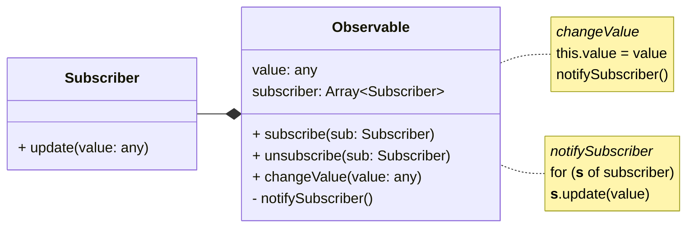

# Blick unter die Haube 👀

---
title: stichwort
class: flex flex-col items-center justify-center
---

<h2 class="mb-2 text-10!">Stichwort</h2>
<h1 class="color-orange text-6xl!">Observer Pattern</h1>

---
title: UML
class: flex flex-col
---

# Observer Pattern

<div class="grow-1" />

<v-clicks>



</v-clicks>

<div class="grow-1" />

---
title: Code Example
---

# Code Beispiel

```js {1,21|2-3|5-11,19|5,12-19|all}{ maxHeight:'90%' }
function observable(value) {
    const subscribers = new Set()
    const notifySubscriber = () => subscribers.forEach((fn) => fn())

    return {
        subscribe(fn) {
            subscribers.add(fn)
        },
        unsubscribe(fn) {
            subscribers.delete(fn)
        },
        set value(updated) {
            value = updated
            notifySubscriber()
        },
        get value() {
            return value
        },
    }
}
```

---
title: Probleme
---

# Was fehlt?

<v-clicks>

> "Automatische Zustandsbindung und Abhängigkeitsverfolgung" - Preact

```js
const count = observable(1)
let double = count.value * 2

count.subscribe(() => {
    double = count.value * 2
})

console.log(double) // 2
countA.value = 2
console.log(double) // 4
```

</v-clicks>

<v-clicks>

1. Manuelles State Binding
    - Umständlich bei mehreren Abhängigkeiten
2. Dependencies sind lose gekoppelt
    - Keine 1:1 Beziehung abgebildet
    - Wer kümmert sich um das unsubscriben?

</v-clicks>
