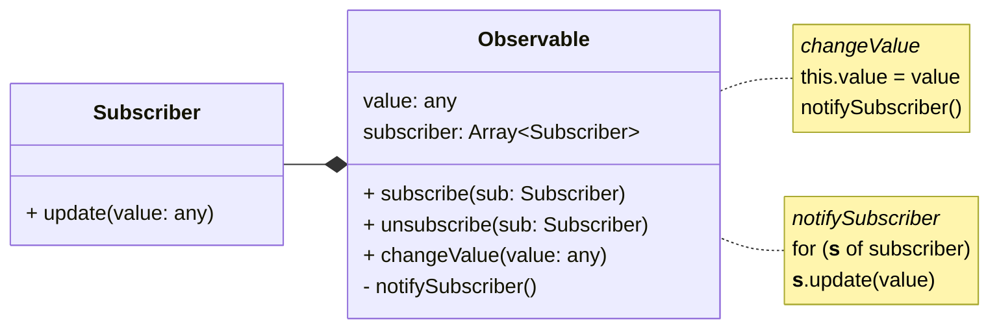

# A Look Under the Hood

---
title: Keyword
class: content-center
---

<div class="*:text-30 *:leading-[0.9em] *:font-bold">
    <div>Keyword</div>
    <div class="-mt-3 color-orange">Observer</div>
    <div class="-mt-4 color-orange">Pattern</div>
</div>

---
title: UML
class: flex flex-col
---

# Observer Pattern

<div class="grow-1" />



<div class="grow-1" />

---
title: Code Example
---

# Code Example

```js {1,21|2-3|5-11,19|5,12-19|all}
function observable(value) {
    const subscribers = new Set()
    const notifySubscriber = () => subscribers.forEach((fn) => fn())

    return {
        subscribe(fn) {
            subscribers.add(fn)
        },
        unsubscribe(fn) {
            subscribers.delete(fn)
        },
        set value(updated) {
            value = updated
            notifySubscriber()
        },
        get value() {
            return value
        },
    }
}
```

---
title: Problems
---

# What's missing?

<v-clicks>

> "Automatic state binding and dependency tracking" - Preact

```js
const count = observable(1)
let double = count.value * 2

count.subscribe(() => {
    double = count.value * 2
})

console.log(double) // 2
count.value += 1
console.log(double) // 4
```

</v-clicks>

<v-clicks>

1. Manual state binding
    - Cumbersome with multiple dependencies
2. Dependencies are loosely coupled
    - No 1:1 relationship mapped
    - Who takes care of the subscription?

</v-clicks>
