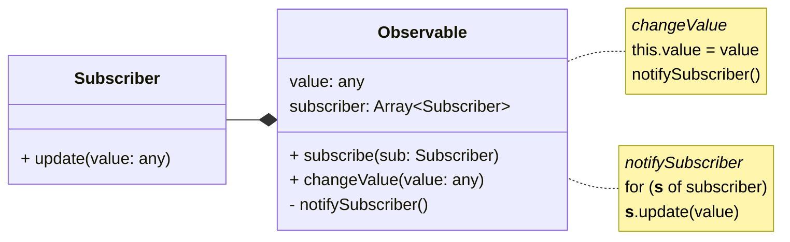

# Blick unter die Haube 👀

---
title: stichwort
class: flex flex-col items-center justify-center
---

<h2 class="mb-2">Stichwort</h2>
<h1 class="color-orange text-6xl!">Observer Pattern</h1>

---
title: UML
class: flex flex-col
---

# Observer Pattern

<div class="grow-1" />

<v-clicks>



</v-clicks>

<div class="grow-1" />

---
title: Code Example
---

# Code Beispiel

```js {1,21|2-6|8-12,20|8,20,13-19|all}{ maxHeight:'90%' }
function observable(value) {
    const subscribers = new Set()

    function notifySubscriber() {
        subscribers.forEach((fn) => fn())
    }

    return {
        subscribe(fn) {
            subscribers.add(fn)
            return () => subscribers.delete(fn) // unsubscribe
        },
        get value() {
            return value
        },
        set value(updated) {
            value = updated
            notifySubscriber()
        },
    }
}
```

---
title: Probleme
---

# Was fehlt?

<v-clicks>

> "Automatic state binding and dependency tracking" - Preact

```js
const countA = observable(1)
const countB = observable(2)
let sum = countA.value + countB.value

const setSum = () => (sum = countA.value + countB.value)
const unsubA = countA.subscribe(setSum)
const unsubB = countB.subscribe(setSum)

console.log(sum) // 3
countA.value = 2
console.log(sum) // 4
```

</v-clicks>

<v-clicks>

1. Manuelles State Binding
    - Umständlich bei mehreren Abhängigkeiten
2. Dependencies sind lose gekoppelt
    - Keine 1:1 Beziehung abgebildet
    - Wer kümmert sich um das unsubscriben?

</v-clicks>

<!--
Hier können wir die Definition vom Anfang ranziehen
"Automatic state binding and dependency tracking"

# Probleme
1. Automatic state binding
    - Manuelles State Binding
    - Multiple State Binding
2. Dependency tracking
    - Wer handelt Unsuscribe?
    - Deps änderungen sind nicht gut abbildbar
-->
